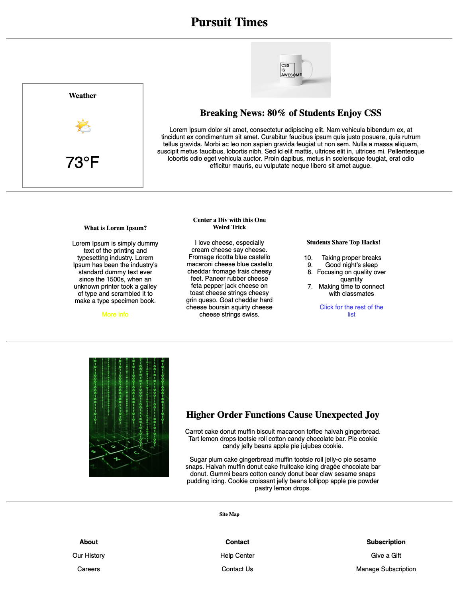
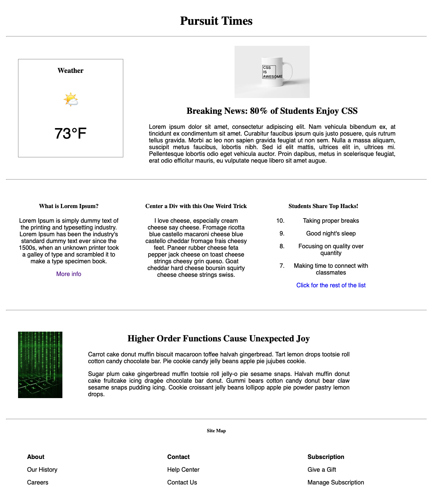

# CSS Box Model Lab

In this lab, you'll have the opportunity to design a student newsletter. The content already exists -- you just need to style it to the best of your ability!

---

## Lab Setup

### Getting started

1. Fork and clone this repository.

1. Navigate to the `settings` tab on GitHub, then choose `Pages` from the menu. Configure the `Build and Deployment` to have a `Source` of `Deploy from a branch` and select the `main` branch for deployment. Deployments can take a few minutes, so get started on the lab, and then be sure to check the deployment after you have made a few commits.

1. Open up the repository in VSCode. Follow the instructions below to complete the Lab.

## Instructions

To complete this lab, you will need to add the following styles. If you're unclear about any of the instructions below, remember that you can check the provided image to see what exactly the appearance should be.

**Hint**: while styling, you can use the following to help see your elements and understand their overall placement and size:

```CSS
* {
   border: 1px solid gold;
}
```

- [ 1] Set all paragraph text to have a font of `sans-serif`.
- [ 2] Set all heading text to have a font of `serif`.
- [ 3] Set all heading text to be centered.
- [4 ] Set all anchor elements to have no text decoration.
- [ 5] Set all anchor elements to have a color of `#4242EA`.
- [ 6] Set all unordered lists to have no list-style.
- [ 7] Set all `span` elements inside the footer to have a `font-weight` of `700`.
- [8 ] Set all paragraph text inside the element with the class of `weather` to have a font size of `40px`.
- [ 9] Set all articles inside the `.above-the-fold` element to have a `display` value of `inline-block`.
- [ 10] Set the `.weather` element to have a `width` of `300px`.
- [11 ] Set the `.weather` element to have a `2px gray border` on all sides.
- [ 12] Set the `.breaking-news` element to have a top/down padding of `0px` and a left/right padding of `30px`.
- [ 13] Set the image inside of the `.breaking-news` element to have a `width` of `200px`.
- [14 ] Set all articles inside the element with the class of `.click-bait` to have a `display` of `inline-block`.
- [ 15] Set all articles inside the element with the class of `.click-bait` to have a `width` of `250px`.
- [ 16] Set all articles inside the element with the class of `.click-bait` to have `16px` of margin and padding on all sides.
- [ 17] Set all articles inside the element with the class of `.click-bait` to have `box-sizing` set to `border-box`.
- [18 ] Set all articles inside the element with the class of `.below-the-fold` to have a `display` of `inline-block`.
- [ 19] Set the image inside the element with the class of `.below-the-fold` to have a `display` of `inline-block`.
- [20 ] Set the image inside the element with the class of `.below-the-fold` to have `16px` of margin and padding on all sides.
- [ 21] Set the image inside the element with the class of `.below-the-fold` to have a `width` of `200px`.
- [ ] Set the div inside the element with the class of `.below-the-fold` to have a `width` of `500px`.

Once your complete with the above tasks, your page should look something like the image below.



Once you've completed these tasks, continue to style your page. Consider adding specific styles to all list items, only list items under the "Libraries" heading, the introductory paragraph, and the "Hardest Bug So Far" section.

## Bonus Ideas

Better alignment of inline elements. There are a few ways to approach this. [Display Flex, and related properties, are recommended](https://css-tricks.com/snippets/css/a-guide-to-flexbox/)


